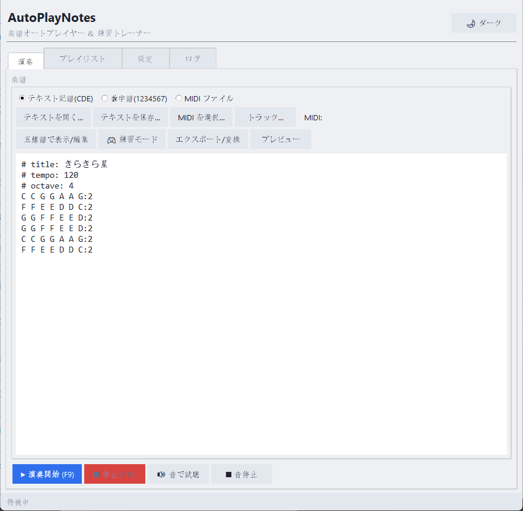
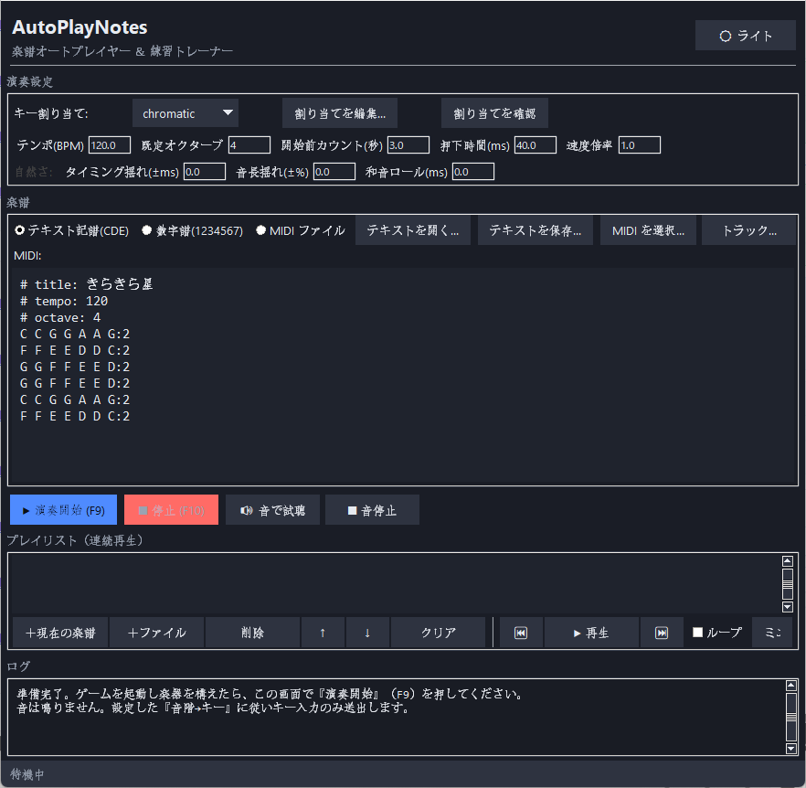

# AutoPlayNotes

**好きな曲を、ゲーム内の楽器で弾けるようになる。** Windows 用のツールです。

弾きたい曲があるのに、譜面が無い。楽譜が読めない。指が動かない。
この3つを、素材が何であれ（楽譜画像・音源・MIDI・手書きのメモ）埋めます。

> **ソースコードは MIT ライセンスで公開しています。** 自分でビルドすれば Python 不要の単体 exe を無料で作れます（[手順](#python-なしで使うexe-をビルド)）。
> ビルド不要ですぐ使える完成版 exe の頒布は準備中です。

### 自分でどこまで弾くかを、曲ごとに決められます

このツールの中心にあるのは **「演奏範囲」** ——鍵盤のうち、**自分の指で弾く範囲**です。
範囲の外はアプリが受け持ちます。

| あなたが弾く範囲 | 範囲の外をアプリが | モード | ゲームにキーを送るか |
|---|---|---|---|
| なし | ゲームへ送る | **自動演奏** | ⚠️ 送る |
| 一部 | ゲームへ送る | **補助演奏** | ⚠️ 送る |
| なし | スピーカーで鳴らす | **試聴**（譜面の確認） | 送らない |
| 一部 | スピーカーで鳴らす | **練習＋伴奏** | 送らない |
| 一部 | 何もしない | **練習** | 送らない |

最初は自動演奏で構いません。**「ドレミファソラシド」の8鍵だけ自分で弾く**ところから始めて、
弾ける範囲を少しずつ広げていけます。範囲を広げても、練習した譜面が別物になることはありません
（音が増えるだけです）。

> ⚠️ **自動演奏と補助演奏は、ゲームへキーを送ります。** 自動入力を禁じているゲームがあります。
> 使用は自己責任です（→ [注意事項](#注意事項)）。**練習・練習＋伴奏・試聴はキーを送りません。**

> **📥 他の楽譜スキャンアプリの成果を、そのまま演奏・練習に使えます。**
> PlayScore・ScanScore・SmartScore・Newzik・MuseScore など、市販/無料の楽譜スキャナーが
> 書き出した **MusicXML / MIDI** を読み込めます。高精度なスキャンは専用ツールに任せ、
> その結果を AutoPlayNotes に取り込めば「**認識 → 実際にゲームで自動演奏・音ゲー型で練習**」まで
> つながります。楽譜のデジタル化ツールで、自動演奏・練習まで連携するものは他にありません。

| ライト | ダーク |
|:---:|:---:|
|  |  |

**🎹 演奏 / 🎵 プレイリスト / ⚙ 設定 / 📄 ログ** のタブ構成で、右上のスイッチで**ライト / ダーク**を切り替えられます（設定は保存されます）。
テンポ(BPM) は演奏タブにも常設され、設定タブと連動します。初回起動時は 3 ステップのクイックスタート画面が案内します。

- キーボード演奏系のアプリ全般に対応（**キー割り当ては自由に設定・保存可能**）
- 楽譜は **数字譜（1〜7）** / **自作テキスト記譜（CDE）** / **MIDI / MusicXML ファイル**（パート選択・単音化・移調対応）から読み込み。**PDF** も取り込み可（各ページを画像化してトレース/OCR/OMR へ）
- **他の楽譜スキャンアプリとの連携** — PlayScore / ScanScore / SmartScore / MuseScore 等が出力した **MusicXML・MIDI** を読み込んで、そのまま自動演奏・練習に使えます（高精度スキャンは専用ツールに任せ、演奏連携は本アプリが担当）
- **画像から数字譜を取り込み（OCR）** — スクリーンショットや写真の数字譜を Windows 内蔵 OCR で読み取り、確認・修正して楽譜欄へ（追加インストール不要）
- **楽譜画像をなぞって入力（トレース）** — 手元の楽譜画像を下敷きに表示し、音符の位置をクリックしていくだけでデータ化。自動認識の待ち時間なしで、**手書き譜・低画質・OMR が苦手な記譜でも音楽知識なしに**入力できます
- **五線譜の画像から取り込み（OMR）** — 外部ツール oemer 連携で楽譜画像を MusicXML 化して読み込み。MuseScore・Audiveris・PlayScore 等**他ツールで作った MusicXML もそのまま開けます**
- **フォーマット変換 & 共有用エクスポート**（テキスト ⇄ 数字譜、共有用の「キー文字譜」書き出し）
- **和音**（同時押し・アルペジオ気味のロール）に対応
- **ヒューマナイズ**（タイミング・音長をランダムに揺らして自然な演奏に）
- **五線譜プレビュー & 簡易エディタ**（音符の追加/削除、♯/♭・音長・音程の後編集、**複数選択への一括操作・Undo/Redo・リップル移動**、演奏中の色分けハイライト、クリック位置からの途中再生、テキストへ反映）
- **音声プレビュー**（キー送出なしでスピーカーから鳴らし、編集中や曲全体を耳で確認）
- **モダンなタブ構成 UI**（customtkinter・演奏 / プレイリスト / 設定 / ログ）と、**ライト / ダーク**テーマ切替（設定保存・タイトルバーも追従）
- **プレイリスト**（複数曲を連続再生・ループ）と、**常に手前に出るミニプレイヤー**
- **演奏範囲（自分で弾くキーの選択）** — 鍵盤に「その曲でそのキーが何回押されるか」を重ねて表示。ドラッグで範囲を選ぶと**必要な指の本数**が即座に分かります。曲ごとに保存
- **練習モード**: ①リズム（落ちノーツを判定ラインで叩く音ゲー型。**長いノーツは押し続けて離す**）②ステップ（次のキーを押すと譜面が進む・指の送り順を覚える）。ゲームに触れず自分で弾いて練習
- **練習＋伴奏** — 演奏範囲の外の音をスピーカーで鳴らしながら、自分の担当だけを弾けます（キー送出なし）
- **補助演奏** — 演奏範囲は自分で弾き、範囲の外だけをアプリがゲームへ送ります（⚠️ キー送出あり・自己責任）
- **音の長さを楽譜どおりに再現** — 押している間だけ鳴る楽器では、全音符は全音符の長さだけキーを押し続けます
- 入力が届きやすい **スキャンコード方式の SendInput** を使用
- **グローバルホットキー**（既定: F9 開始 / F10 停止）で対象アプリの画面のまま操作可能
- **exe 版は追加インストール不要**（ソースから起動する場合は `customtkinter`、MIDI を使う場合のみ `mido` が必要）

---

## 動作環境

- Windows 10 / 11
- Python 3.10 以降（tkinter を含む標準構成）

## 起動方法（ソースから）

```
pip install -r requirements.txt
python main.py
```

（必須の依存は GUI 用の `customtkinter` のみ。`mido` は MIDI 読み込みを使う場合だけ必要です）

### Python なしで使う（exe をビルド）

Python を入れずにダブルクリックで起動できる**単一 exe** を作れます（PyInstaller・`customtkinter` / `mido` 同梱）。

```
python -m pip install -r requirements.txt -r requirements-dev.txt
python build.py
```

`dist/AutoPlayNotes.exe` が生成されます。Python のインストールは不要で、配布もこの 1 ファイルだけで済みます。

> 初回起動は展開のため数秒かかります。未署名のため Windows SmartScreen の警告が出た場合は
> 「詳細情報」→「実行」を選んでください。

---

## 使い方（基本の流れ）

1. `python main.py` でアプリを起動する
2. **設定タブ**の「キー割り当て」で対象アプリに合ったプリセットを選ぶ。必要なら「割り当てを編集...」で自由に設定する
3. **演奏タブ**で楽譜を用意する（数字譜/テキストを打ち込む・ファイルを開く・MIDI を選ぶ）
4. 対象アプリを起動し、楽器を演奏できる状態にする
5. **F9**（または「演奏開始」ボタン）を押す → カウントダウン後に自動演奏
6. 途中で止めたいときは **F10**（または「停止」ボタン）

> ⚠️ 開始を押したら、カウントダウンの間に**対象アプリのウィンドウをクリックしてフォーカスを移して**ください。
> キー入力は「今フォーカスのあるウィンドウ」に送られます。安全に試すには、まずメモ帳など
> 無関係のウィンドウにフォーカスして動作確認するのがおすすめです。

---

## キー割り当て（音階 → キー）

「割り当てを編集...」で、1 行 1 対応のテキストとして編集します。

```
C4 = a
D4 = s
E4 = d
...
```

- 「名前」を付けて保存すると、プリセットとして一覧に追加され次回も使えます
- **音域外の扱い**を選べます:
  - `transpose`（既定）: オクターブ移調して鍵盤内に収める
  - `nearest`: 最も近い音のキーへ丸める（ペンタトニック鍵盤向け）
  - `skip`: 割り当てのない音は鳴らさない
- **「押している間ずっと鳴る楽器（ピアノ系）」** のチェックで、楽器の発音方式を切り替えます
  - オン（既定）: 音長どおりキーを押し続けます。ピアノ・オルガン・弦楽器など
  - オフ: 押した瞬間に鳴って減衰する楽器（撥弦・打楽器）。一定時間のタップで送ります

### 同梱プリセット

| 名前 | 構成 |
|------|------|
| `chromatic` | クロマチック（黒鍵あり）3 オクターブ・半音対応=36鍵 |
| `diatonic` | 全音階（白鍵のみ）3 オクターブ×7音=21鍵（ZXCVBNM / ASDFGHJ / QWERTYU） |
| `pentatonic` | ペンタトニック 15鍵 |

`chromatic`（黒鍵ありフル配列）の並びは次のとおりです。実ピアノ同様、白鍵の間の上に黒鍵を置く配置です。

```
高音(5): 白 Q W E R T Y U      黒 2 3 _ 5 6 7
中音(4): 白 Z X C V B N M      黒 S D _ G H J
低音(3): 白 , . / O P [ ]       黒 L ; _ 0 - =
```

> 記号キー（低音）は配列やロケール（日本語JIS / 英語US）で物理位置が異なることがあります。
> ずれていたら、対象アプリの画面で実際のキーを確認し「割り当てを編集...」で合わせてください
> （英字・数字キーは JIS/US で同じ位置です）。音域外の音は「音域外の扱い = transpose」で
> 自動的にオクターブ移調して鍵盤内へ収めます。

---

## 数字譜の書き方

先頭にヘッダ（`# ` で始まる行）、その後に数字で音を書きます。

```
# title: きらきら星
# tempo: 120
# key: C            ← 主音（movable do。1 がこの音になる）
# octave: 4         ← 数字 1（無印）が属するオクターブ
1 1 5 5 6 6 5:2
4 4 3 3 2 2 1:2
```

| 記法 | 意味 | 例 |
|------|------|----|
| `1`〜`7` | ドレミファソラシ（key=C なら C D E F G A B） | `1`=ド `5`=ソ |
| `1'` | オクターブ上（`'` を重ねるほど上） | `1''`=2オクターブ上 |
| `1,` | オクターブ下（`,` を重ねるほど下） | `5,`=低いソ |
| `#1` `b3` | 半音上げ / 下げ | `#4`=ファ♯ |
| `数字:拍数` | 拍数（省略時 1 拍） | `1:2`（2拍） |
| `1+3+5` | 和音（同時押し） | ド＋ミ＋ソ |
| `-` | 直前の音を伸ばす | `1 - -`（3拍） |
| `0` | 休符 | `1 0 1` |
| `\|` | 小節線（無視） | `1 2 \| 3 4` |

> 注意: 数字譜では `#` をシャープに使うため、ヘッダ／コメント行は
> **`# `（# のあとに半角スペース）** で始めてください。`#1` は「シャープのド」です。

### 画像から数字譜を取り込む（OCR）

SNS などで画像として共有されている数字譜は、手で書き写さなくても取り込めます。

1. 演奏タブの **「📷 画像から数字譜」** から
   **「画像ファイルを開く...」**（PNG / JPG など）または
   **「クリップボードの画像から」**（`Win+Shift+S` で数字部分を範囲コピーしてから）を選ぶ
2. 認識結果が数字譜に整形されて確認ダイアログに表示される
3. 誤認識があればその場で修正 →「解析チェック」で音数を確認 →「楽譜欄へ反映」

- Windows 10 / 11 内蔵の OCR を使うため**追加インストールは不要**です（Windows の言語機能に OCR が含まれている必要があります）
- 数字の連なり（`1155665`）は自動で 1 音ずつに分割され、`#` `b` `'` `+` `:拍` も認識されます
- 精度を上げるコツ: **数字部分だけを大きめに切り取る**・文字がにじんでいない画像を使う
- 対象は「数字を並べた簡略数字譜」です。オクターブを**数字の上下の点**、音長を**下線**で表す
  正式な简谱の読み取りには対応していません（読めなかった記号は確認ダイアログで補ってください）

### 楽譜画像をなぞって入力する（トレース）

自動認識（OMR）は品質にばらつきがあり、手書き譜や低画質の画像は苦手です。
**トレース入力**は逆転の発想で、画像を下敷きに表示し、人が音符の位置を
クリックしていくだけでデータ化します。自動認識の待ち時間ゼロ・音楽知識不要です。

1. 演奏タブの **「📷 画像から取り込み」→「楽譜画像をなぞって入力（トレース）...」** で楽譜画像を選ぶ
2. **「① 音高キャリブレーション」** を押し、五線の**上端の線→下端の線**の順にクリックする
   （それぞれの音は既定でト音記号の `F5` / `E4`。別の音部記号なら上のドロップダウンで変更）。
   これで「画像の高さ → 音の高さ」の対応ができ、音高グリッドが画像に重なって表示されます
3. **音の長さ**と**変化記号（♮/♯/♭）**を選び、画像の**音符の位置を順にクリック**していきます。
   音高は画像から読み取られ、拍は「クリックした順 × 選んだ長さ」で決まります（テキスト記譜と同じ考え方）
4. **和音**は「和音として重ねる」をオンにして同じ位置に重ねてクリック。
   **休符**は「休符（送る）」で 1 つ分空けます。誤クリックは**右クリックで削除**・**元に戻す**で戻せます
5. **「楽譜に反映」** でテキスト記譜として取り込まれ、そのまま演奏・「五線譜で表示/編集」で微調整できます

- 段が変わる（折り返す）楽譜は、その段でもう一度「音高キャリブレーション」をやり直してください
  （既に置いた音符はそのまま保持されます）
- 画像は PNG / JPG / BMP、および **PDF**（各ページを画像化。上部の「ページ」で切替）に対応。
  PDF の別ページに置いた音符もまとめて 1 曲として書き出せます
- 画像処理に Pillow、PDF に pypdfium2 を使用（いずれも exe 版には同梱済み）

### 五線譜の画像から取り込む（OMR・oemer 連携）

五線譜（印刷された楽譜のスキャン・写真）は、外部の OMR ツール
[oemer](https://github.com/BreezeWhite/oemer)（MIT License）と連携して取り込めます。

1. Python 環境で oemer をインストールしておく（深層学習モデルを使うため任意導入）。
   **oemer 0.1.8 は最新の numpy / scipy と非互換**のため、バージョンを合わせて入れます:

   ```
   pip install oemer "numpy<2" "scipy==1.13.*" "opencv-python-headless<4.10"
   ```

   GPU が無い環境では `onnxruntime-gpu` の代わりに CPU 版でも動きます
   （`pip uninstall onnxruntime-gpu` → `pip install "onnxruntime<1.20"`。依存警告は無視して構いません）
2. 演奏タブの **「📷 画像から数字譜」→「五線譜の画像から (OMR)...」** で楽譜画像を選ぶ
3. 認識には**数分かかることがあります**（進捗はステータスバーに表示）。
   結果の MusicXML は画像と同じフォルダに保存され、そのままパート選択 → 読み込みへ進みます
4. 認識結果は**下書き品質**です。「五線譜で表示/編集」で修正してください
   （複数選択・一括操作・Undo/Redo はこの用途のために強化されています）

> oemer を使わなくても、**MusicXML（`.musicxml` / `.xml` / `.mxl`）の読み込み自体は追加インストール不要**です。
> MuseScore・Audiveris・PlayScore など他のツールでデジタル化した楽譜を
> 「MIDI/XML を選択...」からそのまま開けます。

---

## テキスト記譜の書き方

先頭にヘッダ（`#` 行）、その後に音を書きます。

```
# title: きらきら星
# tempo: 120        ← BPM
# octave: 4         ← オクターブ省略時の既定値
C C G G A A G:2
F F E E D D C:2
```

### 音の書き方（トークンは空白区切り）

| 記法 | 意味 | 例 |
|------|------|----|
| `C` `D` … `B` | 音名（既定オクターブ） | `C` `G` |
| `C4` `A5` | オクターブ指定 | `C4`=中央のド |
| `C#` `Eb` | シャープ / フラット | `F#4` `Bb3` |
| `音:数値` | 拍数（省略時 1 拍） | `C:2`（2拍）`C:0.5`（半拍） |
| `音+音+音` | 和音（同時押し） | `C+E+G` |
| `音+音:数値` | 和音＋拍数 | `C+E+G:2` |
| `-` | 直前の音を伸ばす（タイ） | `C - -`（3拍のド） |
| `R` `r` `0` `_` | 休符 | `C R C` |
| `\|` | 小節線（見やすさ用・無視される） | `C D \| E F` |

- MIDI 番号: `C4 = 60`（中央のド）
- `# ` 行のうち `tempo` / `octave` / `title` 以外は単なるコメントとして無視されます

サンプルは `samples/` にあります（`kirakiraboshi.txt`, `kirakiraboshi_number.txt`, `ode_to_joy.txt`）。

---

## エクスポート / 変換

**「エクスポート/変換」** ボタンで、いま読み込んでいる楽譜（テキスト/数字譜/MIDI いずれでも）を
別の形式へ変換したり、共有用に書き出したりできます。すべて内部の共通データを介するので、
**どの入力からどの形式へも**変換できます。

| 出力形式 | 用途 |
|---------|------|
| **テキスト(CDE)** | `C D E`… の自作記譜。数字譜や MIDI からの変換先にも |
| **数字譜(1-7)** | `1 2 3`… の簡易譜。主音（キー）を選べます。テキストとの相互変換に |
| **キー文字譜（共有用）** | 実際に押すキーの並び（`[ ]`=同時押し、`|`=小節）。人に配って手弾き用にも |

さらに、他ツール連携用に **MIDI / MusicXML ファイルとして書き出せます**（ダイアログ下部の
「MIDI で保存...」「MusicXML で保存...」）。トレースや編集で作った楽譜を **MuseScore・Sibelius・
Dorico** など標準の記譜ソフトへ持ち出せます（いずれも追加インストール不要で書き出せます）。

- **休符・拍もそのまま扱えます**: テキスト(CDE)・数字譜は休符（`R`/`0`）・音の長さ（`:拍`）・タイ（`-`）を保持し、
  **往復変換しても崩れません**。五線譜しか分からない曲を手作業で再現するときも、この2形式なら忠実に写せます
- キー文字譜は既定で **「休符・拍を含める（再現用）」** がオン。`_`=休符、`:拍`=音の長さ付きでリズムを再現できます
  （オフにすると、押すキーだけを並べた簡易版になります）
- **コピー** / **保存...** でクリップボードやファイルへ
- テキスト・数字譜は **「この形式で楽譜欄に反映」** で、そのままエディタに読み込んで演奏・編集できます
  （例: 手持ちの**数字譜を CDE に**、または**その逆**に変換）
- キー文字譜は現在の**キー割り当て**に基づいて生成されます（配布相手の環境に合わせて割り当てを揃えてください）

---

## MIDI / MusicXML のパート選択

「MIDI/XML を選択...」でファイルを開くと、**パート選択ダイアログ**が出ます。
（MusicXML の読み込みは追加インストール不要。MIDI のみ `mido` が必要です）

- 1 つの MIDI / MusicXML は複数パート（メロディ・伴奏・ベース・ドラム）に分かれています。
  ダイアログには**各パートの名前・音色・音数・音域**が並びます
- 鳴らしたいパートだけにチェックを入れます（**ドラム / 打楽器は既定でオフ**）
  - おすすめは **メロディのパートだけ**（一番きれいで確実）
- **単音化（最高音だけ）**: 和音を含むパートでも「各時点で一番高い音＝主旋律」だけを拾います。
  同時押しに弱い楽器や、メロディだけ欲しいときに有効
- **オクターブ移調**: 全体を -3〜+3 オクターブずらします（ベースが低すぎる等の調整に）
- 設定を変えたいときは「パート...」ボタンで再選択できます

> 音域が限られた 1 つの楽器でフル編成をそのまま流すと濁りがちです。
> 「メロディだけ選ぶ」だけで既存 MIDI がぐっと実用的になります。

---

## 演奏範囲（自分で弾くキーを決める）

**「🎹 演奏範囲」** ボタンで選択画面が開きます。曲ごとに保存され、次からは自動で適用されます。

```
Z C3 ████      ← 棒の高さ = その曲でそのキーが押される回数
C E3 ████         音が固まっているところが主旋律です
A C4 ███
S D4 ██
D E4 ██  …

窓        鍵数  必要な指  あなたの音
C4〜C5     8      1      14/22   ← メロディだけを 1 本指で
C3〜B3     7      2       8/22   ← ここを選ぶと伴奏を練習することになる
C3〜C5    15      3      22/22   ← 原曲
```

- 鍵盤の上に**その曲でそのキーが何回押されるか**を重ねて表示します。音の密度を見れば、
  楽譜が読めなくても「どこが主旋律か」が分かります。
- ドラッグで範囲を選ぶと、**鍵数・必要な指の本数・自分が弾く音の数**がその場で更新されます。
  範囲が狭くても和音があれば指は複数本要るので、**選ぶ前に代償が見えます**。
- **「おすすめ（指 1 本）」** ボタンで、1 本指で最も多くの音を弾ける範囲を自動で選べます。

初めてその曲の練習モードを開くときに、この画面が出ます。

## 補助演奏（自分の範囲だけ弾き、残りはアプリが送る）

演奏タブの **「補助演奏」** にチェックを入れると、F9 でアプリが**演奏範囲の外だけ**を
ゲームへ送ります。あなたは自分の範囲を弾いてください。

範囲で分けているため、**あなたが押すキーとアプリが送るキーは曲を通して重なりません**。
同じ物理キーを取り合うことがないので、両方が同時にゲームへ入力できます。

> ⚠️ 自動演奏と同じくゲームへキーが飛びます。使用は自己責任です。

## 演奏パラメータ

| 項目 | 説明 |
|------|------|
| テンポ(BPM) | テキスト記譜の再生速度（MIDI はファイル内の BPM を優先） |
| 既定オクターブ | 音名にオクターブ省略時の値 |
| 開始前カウント(秒) | F9 後、演奏開始までの猶予（対象アプリへフォーカス移動する時間） |
| 最短押下時間(ms) | キーを押し下げる最低時間。**持続音の楽器では音長がこれを上回ります** |
| 再発音の間隔(ms) | 同じキーを鳴らし直すとき、離してから押すまでの間隔（既定 25ms） |
| 速度倍率 | 全体の再生速度（2.0 で 2 倍速） |

**音の長さは楽譜どおりに再現されます。** ピアノのように押している間だけ鳴る楽器では、
全音符は全音符の長さだけキーを押し続けます（キー割り当ての「持続音」設定で切り替え）。

同じキーを続けて鳴らすときは、いったん離してから押し直します。多くのゲームは
**キーを押し下げた瞬間にしか発音しない**ため、離さずに押し直しても鳴らないからです。
`再発音の間隔` は 60fps のゲームが 1 フレーム（約 16.7ms）で状態を読むことを見込んだ既定値です。
音が抜けるときは 30〜40ms へ上げてみてください。

設定は自動保存され、次回起動時に復元されます（`%APPDATA%\AutoPlayNotes\config.json`。
上書き前の内容は `config.json.bak` に残ります）。

### 自然な演奏（ヒューマナイズ）

機械的に一定な演奏を、人間らしく少し揺らします。

| 項目 | 説明 | 目安 |
|------|------|------|
| タイミング揺れ(±ms) | 各音の発音タイミングをランダムに前後させる | 10〜30 |
| 音長揺れ(±%) | 1音の押下時間をランダムに増減（±50%まで） | 10〜30 |
| 和音ロール(ms) | 和音を低音から少しずつずらして鳴らす（アルペジオ気味） | 15〜40 |

- すべて 0 にすれば完全に一定の演奏になります。
- 和音ロールは、同時押しを取りこぼしやすいときの**入力の確実性向上**にも役立ちます。

---

## 五線譜プレビュー / 編集

「五線譜で表示/編集」ボタンで、現在の楽譜を五線譜ウィンドウに表示します。

- **音高＝縦位置、時間＝横位置**で描画（音の長さは右へ伸びる横バー）
- **緑の音符＝演奏可能**、**赤の音符＝現在の割り当てでは音域外**（マッピングを直すか transpose に任せる）

### 音符を入力する

- **左クリック**（空き位置）で音符を追加。追加する音符の**長さ**と**変化記号（♮/♯/♭）**はツールバーで選べます
- 同じ位置に音を足すと**和音**になります
- **右クリック**で音符を削除

### 音符を選択する（複数選択対応）

| 操作 | 方法 |
|------|------|
| 1 つ選択 | 音符を左クリック（青い枠が付く） |
| まとめて選択 | 空き位置から**ドラッグ**して矩形で囲む |
| 選択に追加 / 除外 | **Ctrl+クリック** |
| 全選択 | **Ctrl+A** |

### 音符を後から編集する

選択中の音符（複数可）に**一括で**適用されます。

| 操作 | ツールバー | キー |
|------|-----------|------|
| ♯ / ♭ / ♮ を付ける | `♯` `♭` `♮` ボタン | － |
| 半音 上げ / 下げ | `半音▲` `半音▼` | ↑ / ↓ |
| オクターブ 上げ / 下げ | `8va▲` `8vb▼` | － |
| 時間を 前 / 後ろ へ | `◀` `▶` | ← / → |
| 長さを変える | 長さを選び「長さを適用」 | － |
| 削除 | `削除` | Delete / BackSpace |
| 元に戻す / やり直す | `↶` `↷` | Ctrl+Z / Ctrl+Y |

- 時間移動の量は「追加音の長さ」で選んだグリッド単位です
- **「以降も一緒に」**をオンにすると、時間移動が**リップル移動**になります
  （選択位置から後ろの音符をまとめてずらす。OMR で音符が 1 個抜けていた箇所に
  空きを作って挿入する、といった修正が簡単になります）

### 演奏の可視化と途中再生

- **「▶ 先頭から演奏」** で先頭から演奏。演奏中は **演奏済み＝水色 / 発音中＝橙** に色が変わり、青い縦線カーソルが進みます
- クリックモードを **「ここから再生」** にして五線譜をクリックすると、**その位置から途中再生**できます
- **「テキストに反映」** で編集結果をテキスト記譜へ書き戻します（休符・拍・タイミングも保持）

> 五線譜の縦位置は幹音（白鍵）基準です。`♯`/`♭` は音符の左に記号で表示されます。

---

## 音声プレビュー（キー送出なしで耳で確認）

対象アプリへキーを送らず、**このアプリのスピーカーから音を鳴らして**内容を確認できます
（追加インストール不要。Windows 標準の音声機能を使用）。

- 演奏タブの **「🔊 音で試聴」**: 現在の楽譜を音で通し再生（「■ 音停止」で停止）
- 五線譜ウィンドウ:
  - **「編集時に音を鳴らす」** にチェックすると、音符を置く/選ぶ/上下するたびにその音が鳴ります
  - **「🔊 通し試聴」** で曲全体を再生（カーソルが同期して動きます／「■」で停止）

> これは「確認用に鳴らす」ための機能で、キー入力（本来の自動演奏）とは別物です。
> 試聴中は対象アプリには何も送られません。

---

## プレイリスト / ミニプレイヤー

複数の曲を続けて演奏できます。

- **「＋現在の楽譜」**: いま編集中の楽譜（テキスト/数字譜/MIDI）をプレイリストに追加
- **「＋ファイル」**: `.txt` / `.mid` を複数まとめて追加
- **削除 / ↑↓ / クリア** で並べ替え・管理
- **「▶ 再生」** で選択曲から連続再生（曲間に少し間を空けて自動で次へ）
- **「ループ」** で最後まで行ったら先頭へ戻ります
- **⏮ / ⏭** で前後の曲へ切り替え
- プレイリストは自動保存され、次回起動時に復元されます

### ミニプレイヤー（常に手前）

**「ミニプレイヤー」** ボタンで、常に最前面に出る小さな操作パネルを開けます。
対象アプリの画面を見ながら、**alt-tab せずに** 再生 / 停止 / 前後の曲 / ループを操作できます。
「常に手前」チェックで最前面表示のオン/オフを切り替えられます。

---

## 練習モード

**「🎮 練習モード」** ボタンで練習ウィンドウを開きます。**ゲーム本体には一切キーを送らない
自己完結トレーナー**なので、安全に指の練習ができます。上部の切り替えボタンで 2 モードを選びます。

```
   Z   X   C   V   B   N   M   ← レーン=キー（曲で使うキーを音高順に）
   │   ▉   │   │   ▉   │   │   ← ノーツ
 ══╪═══╪═══╪═══╪═══╪═══╪═══╪══  判定ライン
```

**この練習ウィンドウにフォーカス**して、自分でキーを押します（ゲームには送りません）。

レーンに並ぶのは **[演奏範囲](#演奏範囲自分で弾くキーを決める) の中のキーだけ**です。
範囲の外の音は **「🎹 伴奏（範囲外の音）」** をオンにすると、スピーカーから一緒に鳴ります。
自分の担当だけを無音で叩くより、曲の中で弾くほうが練習になります。

### ① リズムモード（音ゲー型）

- 楽譜どおりのテンポでノーツが落ちてきます。**判定ラインに来た瞬間に対応キーを叩く**
- **長いノーツは押し続けて、終わりで離します。** 早く離すと音が途切れ、離し忘れると
  鳴り続けるので、どちらも Miss になります
- **Perfect / Good / Miss** で判定し、**コンボ・スコア・精度**を表示。終了時にリザルト
- 内蔵の**音声を同期再生**（見て・聴いて・叩く）。**速度**0.5〜1.25倍でゆっくり練習も
- **🎵 メトロノーム**: 各拍にクリックを鳴らします（小節頭はアクセント）。「音を鳴らす」をオフにすれば
  クリックだけで練習でき、テンポを体に入れるのに役立ちます
- **A-B ループ**: 難所を繰り返し練習できます。「A設定」「B設定」で区間の始点・終点を今の再生位置に置き、
  「ループ」をオンにすると A〜B を自動で繰り返します（「解除」で全解除）

### ② ステップモード（送り・指順を覚える）

- **テンポ・リズムは不問**。次に光ったキーを押すと、譜面が 1 つ先へ進みます
- 弾ける速さで、**指の送り順（運指）**をじっくり覚えられます
- **和音**は、そのステップのキーを全部押すと次へ進みます
- 押すたびにその音が鳴るので、音でも確認できます

> どちらもレーンは「その曲で使うキー」だけを音高順に並べます。まずステップで運指を覚え、
> 次にリズムでテンポに乗せる、という流れが効果的です。

### シーク（送り／戻し）— 両モード共通

難しい箇所だけ繰り返し練習できるよう、位置を前後に飛ばせます。

- **← / →** キー、または **⏪ / ⏩** ボタンで送り／戻し
- 送り幅は **1 / 3 / 5 / 10 秒** から選択
- **演奏中**: その場で位置を前後にジャンプ（リズムは音声も新しい位置から鳴り直し、通り過ぎた音は「済み」・以降は再挑戦可）
- **停止中**: 押すと**開始位置マーカー**が動きます。位置を決めてから **スタート**すると、その位置から始まります（難所やサビだけを繰り返し練習できます）

### 下部の五線譜（参照用）

練習ウィンドウの下部に**実際の五線譜**を表示します（両モード共通・編集不可）。
音ゲー表示だけでなく本物の楽譜も見ながら練習でき、**再生位置に合わせて青いカーソル**が動きます。

---

## 構成（開発者向け）

```
autoplaynotes/
├── win_input.py    SendInput（スキャンコード方式）でキー送出
├── hotkey.py       RegisterHotKey によるグローバルホットキー
├── model.py        楽譜データモデル（NoteEvent / Score）
├── number_parser.py 数字譜（1〜7）のパーサ
├── text_parser.py  自作テキスト記譜（CDE）のパーサ / Score→テキスト
├── convert.py      フォーマット変換（数字譜・キー文字譜の書き出し）
├── score_export.py MIDI / MusicXML 書き出し（純 Python・追加依存なし）
├── midi_parser.py  MIDI 読み込み（mido、任意）
├── pdf.py          PDF ページの画像化（pypdfium2・任意）
├── keymap.py       音階→キーのマッピングとプリセット
├── player.py       演奏エンジン（別スレッド・停止可能・ヒューマナイズ）
├── audio.py        確認用の音声プレビュー（winsound＋サイン波合成）
├── staff.py        五線譜プレビュー / 簡易エディタ（Canvas）
├── trace.py        楽譜画像トレース入力（画像を下敷きになぞる・Pillow）
├── ocr.py          数字譜画像の OCR（Windows 内蔵）
├── omr.py          五線譜画像の OMR（oemer 連携・任意）
├── musicxml_parser.py MusicXML 読み込み（標準ライブラリのみ）
├── playlist.py     プレイリスト（連続再生）のデータモデル
├── practice.py     練習モード（音ゲー型・落ちノーツ＋判定）
├── theme.py        配色テーマ（ライト/ダーク・customtkinter ブリッジ）
├── resources.py    同梱リソース（assets/）のパス解決
├── config.py       設定の保存/読み込み
└── gui.py          customtkinter GUI
main.py             起動エントリポイント
assets/             アプリアイコン等の同梱リソース
```

---

## 注意事項

- **対象アプリ / 規約の確認**: アプリやゲームによっては、自動入力・自動演奏ツールの使用が
  利用規約で禁止されている場合があります。使用は各自の責任と判断で行ってください。
  本ソフトはキーボード操作を自動化する汎用ユーティリティであり、特定のアプリの利用を
  推奨・保証するものではありません。
- **キーを送るのは「自動演奏」と「補助演奏」だけです。** 練習モード・練習＋伴奏・音声プレビューは
  ゲームへ一切キーを送りません。自分の指で弾くぶんには、このツールは何も自動化しません。
- **アンチチート**: 一部のオンラインアプリは合成入力を検知・ブロックすることがあります。
  スキャンコード方式で多くのケースに対応していますが、すべての環境での動作は保証しません。
- **入力先はフォーカス中のウィンドウ**です。誤って別のアプリに入力されないよう、
  必ず対象アプリにフォーカスを合わせてから演奏してください。
- 管理者権限で動作するアプリへ入力する場合、本アプリも管理者として起動する必要が
  あることがあります。

## ライセンス

本体のソースコードは **MIT License**（`LICENSE` を参照）。

同梱・利用しているオープンソースソフトウェアの一覧とライセンスは
**[THIRD-PARTY-NOTICES.md](THIRD-PARTY-NOTICES.md)** にあります
（`tools/gen_third_party_notices.py` が実際の配布物から生成します）。

採譜アドオンには LGPL / MPL のライブラリ（`soxr`・`certifi`）が含まれます。いずれも改変せず
同梱し、ライセンス全文を配布物に含めています。Python パッケージとして実行時に読み込まれるため、
利用者が自前ビルドへ差し替えることもできます。
